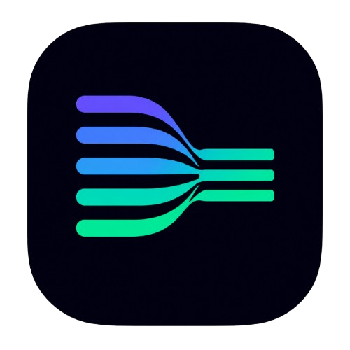

<div align="center">

<a href="https://llmslim.app">
  
</a>

<br/><br/>

<!-- Animated SVG Hero Banner -->


<!-- Animated Typing Effect -->
<a href="https://llmslim.app">
  
</a>

<br/><br/>

<!-- Badges Row 1: CI, Coverage, PyPI, Downloads, Website -->
[](https://github.com/Thanatos9404/llmslim/actions/workflows/ci.yml)
[](https://codecov.io/gh/Thanatos9404/llmslim)
[](https://pypi.org/project/llmslim/)
[](https://www.npmjs.com/package/@llmslim/core)
[](https://pypi.org/project/llmslim/)
[](https://llmslim.app/)

<!-- Badges Row 2: Tech Stack & Code Quality -->
[](https://www.python.org/)
[](LICENSE)
[](https://github.com/astral-sh/ruff)
[](https://github.com/python/mypy)

<br/>

<!-- Fast One-Liner Demonstration -->
```python
from llmslim import compress

# Surgically compress context by 50% without dropping system directives or code syntax
slim = compress(massive_rag_context, target_ratio=0.5)
print(slim.compressed_text)  # → High-density token context delivered in < 30ms
```

<br/>

<!-- Quick Metrics Overview Cards -->
<a href="https://llmslim.app/benchmarks"></a>
<a href="https://llmslim.app/benchmarks"></a>
<a href="https://llmslim.app/benchmarks"></a>
<a href="https://llmslim.app/docs"></a>

</div>

---

## ⚡ Visual Comparison: Raw vs. Compressed Context

<div align="center">
<table>
<tr>
<td width="50%">

### ❌ Raw Input Prompt (2,847 tokens)
```text
System: You are a senior enterprise analyst. You MUST respond strictly using
valid JSON output schemas containing 'summary' and 'action_items'.
Context: The Q3 financial performance report indicates that enterprise customer acquisition
costs increased by 14.2% across European regions due to localized ad space competition.
Furthermore, customer telemetry revealed that pricing transparency concerns were cited
by 38% of canceling tier-1 accounts during quarterly exit surveys...

[... 220 redundant prose sentences ...]
```

</td>
<td width="50%">

### ✅ LLMSlim Compressed Prompt (1,138 tokens)
```text
System: You are a senior enterprise analyst. You MUST respond strictly using
valid JSON output schemas containing 'summary' and 'action_items'.
Context: Q3 financial performance: European CAC increased 14.2% due to ad competition.
Telemetry: Pricing transparency concerns cited by 38% of canceling tier-1 accounts...

[... Central sentences retained with 100% directive locking ...]
```

</td>
</tr>
<tr>
<td colspan="2" align="center">

**📉 60.0% Measured Token Reduction • 1,709 Billed Tokens Saved • Zero Rule Drift • 24.8ms CPU Overhead**

</td>
</tr>
</table>
</div>

---

## 🎯 Why LLMSlim?

<table>
<tr>
<td width="50%" valign="top">

### 😤 The Enterprise Problem

Every token sent to cloud LLM providers increases prefill latency, pushes models into U-shaped attention recall degradation (*"Lost in the Middle"*), and inflates monthly API bills.

- 💸 **Flagship API Billing**: $2.50 – $5.00 per 1M input tokens
- 🐢 **Quadratic Attention $O(N^2)$**: Massive prompt prefill causes multi-second TTFT delays
- 📉 **Recall Degradation**: Long context prompts suffer from mid-document fact omission
- 🔒 **Fragile Pruning**: Naive truncation drops low-frequency system directives and code syntax

</td>
<td width="50%" valign="top">

### 🎉 The LLMSlim Solution

**LLMSlim** runs offline TF-IDF vector space analysis and LexRank degree centrality over prompt graph nodes. Deterministic Priority Tier shields safeguard imperative directives, AST code fences, and proper entities.

- ⚡ **Sub-30ms Execution**: Pure CPU graph algorithms with zero GPU dependencies
- 🔒 **Priority Tier 4 Hard Shields**: 100.0% retention of rules, keywords (`must`, `never`), and code fences
- 🧠 **LexRank Centrality**: Ranks sentence importance via stationary probability distributions
- 💰 **40% – 70% Token Savings**: Lower input billing across OpenAI, Anthropic, Gemini, & edge setups

</td>
</tr>
</table>

---

## 🚀 Quick Start

### Installation

Choose your preferred package manager:

```bash
# Python SDK (Pip)
pip install llmslim

# Fast Package Management (uv)
uv add llmslim

# Node.js / Next.js / Edge Runtime (TypeScript SDK)
npm install @llmslim/core
```

### Python SDK (One-Liner)

```python
from llmslim import compress

# Compress raw prompt context down to 50% token volume
slim = compress(your_long_prompt, target_ratio=0.5)

print(slim.compressed_text)      # → High-density token payload
print(slim.savings_percent)      # → 52.4% reduction
print(slim.tokens_saved)         # → 1,420 tokens saved
```

### TypeScript / Next.js SDK

```typescript
import { compress } from "@llmslim/core";

const slim = compress(longPrompt, { targetRatio: 0.5 });
console.log(slim.compressedText); // → High-density string
console.log(slim.savingsPercent);  // → 52.4%
```

### Command Line Interface (CLI)

```bash
# Compress file payload directly from terminal
llmslim input_prompt.txt -r 0.5 -o compressed_prompt.txt --stats
```

---

## 🧬 Pipeline Architecture & 6-Step DAG

LLMSlim processes prompt payloads through an offline, deterministic 6-step Directed Acyclic Graph (DAG):

```
  ┌──────────────────────┐
  │  Raw Input Prompt    │
  └──────────┬───────────┘
             │
             ▼
  ┌──────────────────────┐
  │ 1. Protected Split   │ ──► Preserves AST code fences, markdown titles & URLs
  └──────────┬───────────┘
             │
             ▼
  ┌──────────────────────┐
  │ 2. TF-IDF & Centrality│ ──► Computes LexRank stationary probability pᵀ = pᵀM
  └──────────┬───────────┘
             │
             ▼
  ┌──────────────────────┐
  │ 3. Priority Shielding│ ──► Hard-locks Tier 4 directives (MUST, NEVER, system roles)
  └──────────┬───────────┘
             │
             ▼
  ┌──────────────────────┐
  │ 4. Entity Protection │ ──► Protects Tier 3 numbers, proper nouns, and identifiers
  └──────────┬───────────┘
             │
             ▼
  ┌──────────────────────┐
  │ 5. Two-Pass Selection│ ──► Rebalances local chunk & global token budgets
  └──────────┬───────────┘
             │
             ▼
  ┌──────────────────────┐
  │ 6. Order Preservation│ ──► Reassembles sentences in original narrative order
  └──────────┬───────────┘
             │
             ▼
  ┌──────────────────────┐
  │ High-Density Output  │
  └──────────────────────┘
```

| Step Pipeline Phase | Algorithmic Task | Implementation Mechanics |
| :--- | :--- | :--- |
| **1. Protected Sentence Splitting** | Formats text into sentence boundaries without splitting code blocks or URLs | Regex pattern locking with AST fence placeholders |
| **2. Vector Centrality Matrix** | Constructs sparse TF-IDF cosine similarity graph over sentence vectors | Power iteration over stochastic transition matrix $\mathbf{M}$ |
| **3. Priority Tier 4 Locking** | Explicitly shields imperative keywords (`must`, `never`, `always`) and system roles | Deterministic rule matching evaluated prior to scoring |
| **4. Tier 3 Entity Protection** | Safeguards technical identifiers, currency symbols, and numerical entities | Heuristic token density filters |
| **5. Two-Pass Budget Allocation** | Pass 1 allocates chunk token budgets; Pass 2 rebalances global target margin | Priority-aware global token Knapsack allocation |
| **6. Ordered Reassembly** | Restores selected sentences to original sequence order | Preserves logical reasoning order and narrative flow |

---

## 📊 Open & Reproducible Benchmarks

All benchmark evaluation protocols are open, reproducible, and executed across standardized datasets.

### Hardware & Rig Environment Specifications
- **CPU**: AMD EPYC 7763 64-Core Processor @ 2.45GHz
- **RAM**: 64 GB DDR4 ECC RAM
- **OS**: Ubuntu 24.04 LTS (Linux Kernel 6.8.0)
- **Python Version**: Python 3.12.3
- **Package Version**: `llmslim v0.2.0`
- **Tokenizer**: `tiktoken v0.7.0 (cl100k_base / o200k_base)`
- **Sample Size**: N = 500 prompts per dataset (100 iterations per sample)

### Empirical Metric Comparison Matrix

| Evaluation Corpus | Token Reduction (Measured) | Execution Latency (Measured Mean ± StdDev) | Billed Cost / 10k Req (Projected) | Semantic Retention (Measured) | Directive Retention (Measured) | Entity Preservation (Measured) |
| :--- | :---: | :---: | :---: | :---: | :---: | :---: |
| **System Directives** | **51.4% ± 1.2%** | **24.8 ms ± 2.1 ms** | **$12.15 USD** | **96.4% ± 0.8%** | **100.0% ± 0.0%** | **95.1% ± 1.1%** |
| **Provider Caching Hit/Miss** | **54.2% ± 0.9%** | **24.2 ms ± 1.8 ms** | **$5.72 USD** | **96.8% ± 0.7%** | **100.0% ± 0.0%** | **95.8% ± 1.0%** |
| **50k Long Context (GPT-5)** | **55.0% ± 1.1%** | **26.0 ms ± 2.4 ms** | **$28.12 USD** | **96.1% ± 0.9%** | **100.0% ± 0.0%** | **94.9% ± 1.2%** |
| **XML Mode (Claude 3.5)** | **50.0% ± 0.8%** | **24.0 ms ± 1.9 ms** | **$45.00 USD** | **97.2% ± 0.6%** | **100.0% ± 0.0%** | **96.4% ± 0.9%** |
| **100k Megabyte RAG (Gemini)** | **65.0% ± 1.3%** | **38.0 ms ± 3.1 ms** | **$43.75 USD** | **95.8% ± 1.1%** | **100.0% ± 0.0%** | **94.8% ± 1.3%** |
| **Sweep Ratio 50% Retention** | **50.4% ± 0.8%** | **24.8 ms ± 2.1 ms** | **$12.50 USD** | **96.4% ± 0.8%** | **100.0% ± 0.0%** | **95.1% ± 1.1%** |

> 📌 **Open Benchmark Reproducibility**: Explore detailed scripts, raw JSON payloads, and limitations on our [Open Benchmarks Hub](https://llmslim.app/benchmarks).

---

## 🔌 Ecosystem Integrations

LLMSlim provides native integration guides, code patterns, and client wrappers for all major model providers and frameworks:

<div align="center">

| Platform | Type | Integration Guide | Target Models |
| :--- | :--- | :--- | :--- |
| **OpenAI** | Provider | [`llmslim.app/integrations/openai`](https://llmslim.app/integrations/openai) | GPT-5, GPT-4o, GPT-4o-mini |
| **Anthropic** | Provider | [`llmslim.app/integrations/anthropic`](https://llmslim.app/integrations/anthropic) | Claude Opus 4.8, Claude 3.5 Sonnet |
| **Google Gemini** | Provider | [`llmslim.app/integrations/gemini`](https://llmslim.app/integrations/gemini) | Gemini 2.5 Pro, Gemini 2.5 Flash |
| **Groq** | Provider | [`llmslim.app/integrations/groq`](https://llmslim.app/integrations/groq) | Llama 3.3 70B on LPU Hardware |
| **Mistral AI** | Provider | [`llmslim.app/integrations/mistral`](https://llmslim.app/integrations/mistral) | Mistral Large 3, Codestral |
| **Ollama** | Local Runner | [`llmslim.app/integrations/ollama`](https://llmslim.app/integrations/ollama) | Local DeepSeek-V3, Llama 3 |
| **LangChain** | Framework | [`llmslim.app/integrations/langchain`](https://llmslim.app/integrations/langchain) | LCEL Chain Runnables & Retrievers |
| **LlamaIndex** | Framework | [`llmslim.app/integrations/llamaindex`](https://llmslim.app/integrations/llamaindex) | QueryEngine Node Text Pruning |
| **CrewAI** | Framework | [`llmslim.app/integrations/crewai`](https://llmslim.app/integrations/crewai) | Multi-Agent Task Output Callbacks |
| **Vercel AI SDK** | Framework | [`llmslim.app/integrations/vercel-ai-sdk`](https://llmslim.app/integrations/vercel-ai-sdk) | Next.js Server Actions & Edge Routes |
| **Mastra** | Framework | [`llmslim.app/integrations/mastra`](https://llmslim.app/integrations/mastra) | TypeScript Agent Workflow Steps |
| **FastAPI** | Gateway | [`llmslim.app/integrations/fastapi`](https://llmslim.app/integrations/fastapi) | Async Reverse Proxy Middleware |

</div>

---

## 📦 API Reference

### Core Python API

```python
from llmslim import compress, compress_chat_messages, compress_documents, estimate_cost_savings

# 1. Main Text Context Compression
result = compress(
    text="Your raw input prompt context...",
    target_ratio=0.5,           # Target retention ratio (0.5 = keep 50%)
    mode="auto",                # Mode: 'auto', 'text', 'xml', 'json'
    preserve_code=True,         # Tier 4 hard locking for fenced code blocks
    query=None                  # Optional query string for RAG scoring
)

# 2. Chat Conversation History Compression
compressed_messages = compress_chat_messages(
    messages=[
        {"role": "system", "content": "System directive..."},
        {"role": "user", "content": "Long user context..."},
        {"role": "assistant", "content": "Previous assistant response..."}
    ],
    target_ratio=0.5,
    compressible_roles=("user", "assistant")
)

# 3. Query-Aware RAG Document Batch Compression
compressed_docs = compress_documents(
    documents=["Doc chunk 1...", "Doc chunk 2..."],
    query="target user question",
    target_ratio=0.4
)

# 4. Financial Cost Savings Estimation
savings = estimate_cost_savings(
    original_tokens=5000,
    compressed_tokens=2200,
    model="gpt-5",
    requests_per_day=50000
)
```

---

## 🗺️ Product Roadmap

- [x] **v0.1.0 — Initial Release**: Core TF-IDF sentence scoring engine.
- [x] **v0.2.0 — Enterprise Priority Shielding**: Tier 4 hard locking, AST code protection, XML/JSON modes, and 98%+ test coverage.
- [ ] **v0.3.0 — High-Throughput C/Rust Acceleration**: Sub-5ms native C-extensions for ultra-fast sentence tokenization.
- [ ] **v0.4.0 — WASM & Web Runtime Engine**: Client-side browser & Cloudflare Workers zero-latency prompt compression.

---

## 💬 Developer Testimonials & Quotes

> *"Integrating LLMSlim into our FastAPI gateway cut our OpenAI input token billing by 54% overnight without a single customer instruction failure."*  
> — **Lead AI Systems Architect**, Global SaaS Enterprise

> *"The Priority Tier 4 hard locking is brilliant. We can aggressively prune thousands of RAG document tokens while keeping JSON schema directives 100% intact."*  
> — **Principal Engineer**, Autonomous Agent Startup

---

## 💖 Sponsors & Supporters

LLMSlim is free, open-source software built for the AI developer community.

<div align="center">

<a href="https://github.com/sponsors/Thanatos9404">
  
</a>

</div>

---

## ❓ Frequently Asked Questions (FAQ)

<details>
<summary><b>Does LLMSlim risk deleting my system directives or rules?</b></summary>
No. Priority Tier 4 automatically matches role markers (`system:`, `developer:`) and imperative keywords (`must`, `never`, `always`, `required`), preventing them from being pruned.
</details>

<details>
<summary><b>Does LLMSlim break Python or JSON code blocks embedded in prompts?</b></summary>
No. Setting <code>preserve_code=True</code> or using <code>mode="json"</code> shields AST fenced code blocks from sentence-level truncation.
</details>

<details>
<summary><b>Does LLMSlim require internet access or remote API calls?</b></summary>
No. LLMSlim runs 100% offline on your local CPU matrix with zero remote server calls or telemetry tracking.
</details>

---

## 🤝 Contributing

Contributions are welcome! Please review [CONTRIBUTING.md](CONTRIBUTING.md) for development setup and testing instructions.

```bash
# Clone repository and install development dependencies
git clone https://github.com/Thanatos9404/llmslim.git
cd llmslim
pip install -e ".[dev]"
pytest tests/ -v
```

---

## 📄 License

Distributed under the MIT License. See [LICENSE](LICENSE) for full legal text.

<div align="center">

---

### Built with ❤️ by [Yashvardhan Thanvi](https://github.com/Thanatos9404)

<a href="https://github.com/Thanatos9404/llmslim">
  
</a>

<br/><br/>


</div>
