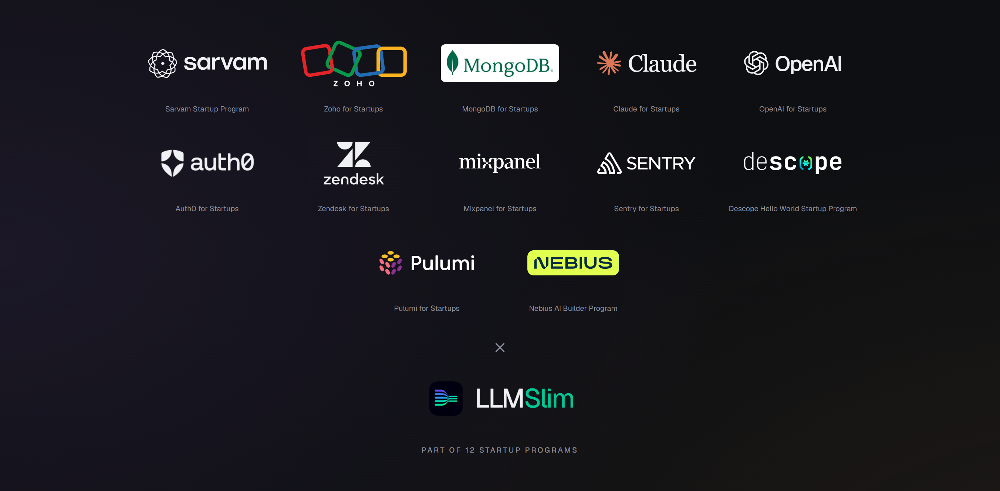
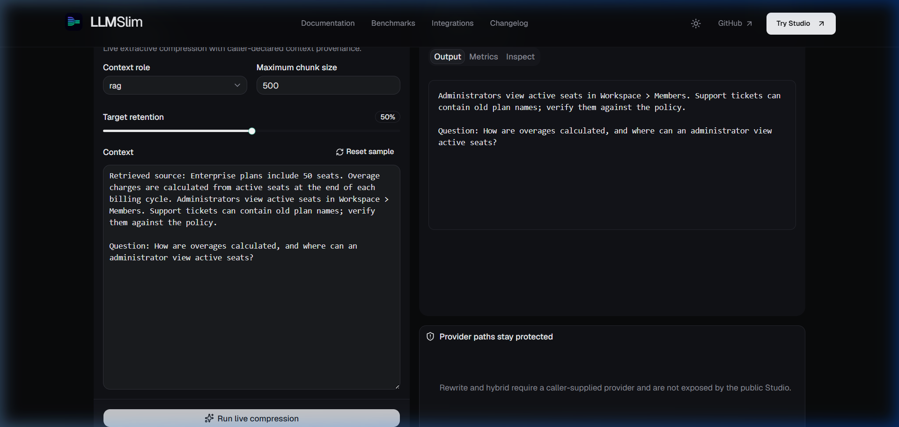
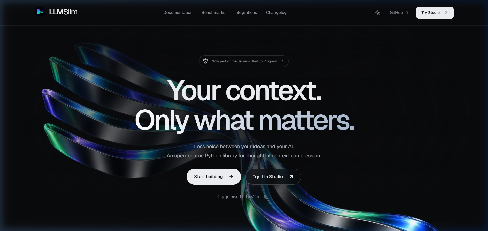
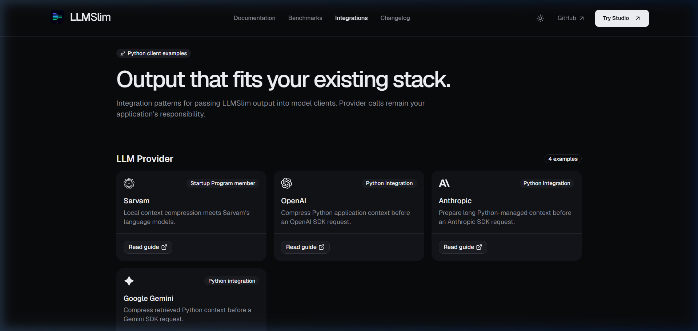

<div align="center">

<a href="https://www.llmslim.app">
  
</a>

<br/><br/>

[](https://pypi.org/project/llmslim/)
[](https://pypi.org/project/llmslim/)
[](https://www.sarvam.ai/startup-program)
[](https://github.com/Thanatos9404/llmslim/actions)
[](https://github.com/Thanatos9404/llmslim)
[](LICENSE)
[](https://www.llmslim.app)

<br/>

**The context layer for production AI agents.**
*This repository is **LLMSlim Core** (v0.7.1, MIT): local-first context planning and compression that fits prompts, conversation history, RAG, memory, and tool schemas into real token budgets while preserving instructions and execution boundaries.*

<br/>

[**Live Studio Playground**](https://www.llmslim.app) • [**Documentation**](https://www.llmslim.app/docs) • [**Sarvam Integration**](https://www.llmslim.app/integrations/sarvam) • [**Benchmarks**](#-benchmarks--radical-transparency) • [**Changelog**](CHANGELOG.md)

</div>

---

## Try it in 60 seconds

**1. Install** LLMSlim Core from PyPI (Python 3.9+). Running it needs no API key, model, or network call:

```bash
pip install llmslim
```

**2. Run** this snippet:

```python
from llmslim import compress

ticket = """
Hi team, I hope you are all doing well and had a good weekend.
I am writing about invoice INV-2291, which charged us $480 instead of $240.
We upgraded to the Pro plan on 3 September, but the old Basic plan was billed as well.
Our finance lead was asking about this during the weekly sync, which ran long as usual.
Please refund the duplicate $240 charge to the card ending 4417.
Thanks so much, and let me know if you need anything else from me.
"""

result = compress(ticket, target_ratio=0.6)  # target: keep about 60% of the tokens
print(result.compressed_text)
print(f"{result.original_tokens} -> {result.compressed_tokens} tokens ({result.reduction_percent:.1f}% fewer)")
```

**3. What you should see** (llmslim 0.7.1, base install):

```text
Hi team, I hope you are all doing well and had a good weekend. I am writing about invoice INV-2291, which charged us $480 instead of $240. We upgraded to the Pro plan on 3 September, but the old Basic plan was billed as well. Please refund the duplicate $240 charge to the card ending 4417.
112 -> 72 tokens (35.7% fewer)
```

Two of the six sentences are dropped; the invoice number, amounts, plan change,
and refund request are kept. The default extractive mode only selects sentences
from your input, so the same input always gives the same output. The base install
estimates tokens at about 4 characters per token and prints a one-line warning
saying so. With `pip install "llmslim[fast-tokens]"`, tokens are counted with
tiktoken instead: on this input the same four sentences are kept, and the count
reads `107 -> 72 tokens (32.7% fewer)`.

**Next:** [Docs](https://www.llmslim.app/docs) • [Platform beta](https://www.llmslim.app/platform) • [Issues](https://github.com/Thanatos9404/llmslim/issues)

If LLMSlim is useful, consider starring the repo or opening an issue with feedback.

---

## LLMSlim Core and LLMSlim Platform

| | **LLMSlim Core** | **LLMSlim Platform** |
|---|---|---|
| Version | 0.7.1 | 0.9.0 beta |
| License | MIT, this repository | Proprietary, private beta |
| Install | `pip install llmslim` | By invitation; not published to PyPI |
| What it does | Compresses, plans, and traces model-visible context inside your Python process | Builds on Core: a verifiable timeline of agent state, explainable and replayable context decisions, and outcome-driven context policies that start in shadow mode |

Core is and stays fully open source. Platform is a separate product that depends on
Core; none of its code lives in this repository. Read more and request beta access at
[llmslim.app/platform](https://www.llmslim.app/platform).

What's new in Core: the [agent context runtime (v0.7.0)](#agent-context-runtime-v070)
and the [cache-aware context runtime (v0.7.1)](#cache-aware-context-runtime-v071).
Both are in the 0.7.1 package on PyPI; 0.7.0 was tagged but not published to PyPI.

---

## Adaptive Context Planner (v0.6.0)

LLMSlim is no longer only a fixed-ratio prompt compressor. The Adaptive
Context Planner chooses safe representations for each context item, then uses
a deterministic constrained allocator to fit the highest-value context into a
finite model budget. The original `compress()` API remains fully supported.

The v0.6.0 release adds explainable per-item decisions, explicit infeasibility
reporting, post-plan validation, token and cost telemetry, policy presets, and
optional Sarvam AI, Zoho, and MongoDB integrations while keeping the base
installation local-first and provider-neutral.

```python
from llmslim import plan_context

plan = plan_context(
    messages=[
        {"role": "system", "content": "Answer only from verified context."},
        {"role": "user", "content": "When does Acme renew?"},
    ],
    documents=[{"content": "CRM: Acme renews on 2026-11-30."}],
    query="Acme renewal date",
    model="sarvam-105b",
    max_input_tokens=8_000,
    reserve_output_tokens=512,
)
assert plan.feasible
print(plan.final_context)
print(plan.metrics.planned_tokens, plan.metrics.estimated_input_cost_after)
```

Planning works offline with the base install. Optional integrations are
isolated behind extras:

```bash
pip install "llmslim[sarvam]"   # Sarvam provider (official sarvamai SDK)
pip install "llmslim[zoho]"     # CRM and WorkDrive context sources
pip install "llmslim[mongodb]"  # explicit memory and Atlas retrieval
```

See the [architecture](docs/planning/ARCHITECTURE.md),
[algorithm](docs/planning/ALGORITHM.md), [security model](docs/planning/SECURITY.md),
[CLI](docs/planning/CLI.md), and [measured offline benchmark](docs/releases/v0.6.0-RELEASE_GATE.md#frozen-benchmark-result).

---

## Startup programs

LLMSlim is part of 11 startup programs. They provide credits, tools, and guidance;
none of them is an investor, and membership does not imply endorsement.

| Program | Company |
|---|---|
| [Sarvam Startup Program](https://www.sarvam.ai/startup-program) | Sarvam AI |
| [Zoho for Startups](https://www.zoho.com/startups/) | Zoho |
| [MongoDB for Startups](https://www.mongodb.com/startups) | MongoDB |
| [Claude for Startups](https://claude.com/programs/startups) | Anthropic |
| [OpenAI for Startups](https://openai.com/startups/) | OpenAI |
| [Auth0 for Startups](https://auth0.com/startups) | Okta (Auth0) |
| [Zendesk for Startups](https://www.zendesk.com/startups/) | Zendesk |
| [Mixpanel for Startups](https://mixpanel.com/startups/) | Mixpanel |
| [Sentry for Startups](https://sentry.io/for/startups/) | Sentry |
| [Descope Hello World Startup Program](https://www.descope.com/for-startups) | Descope |
| [Pulumi for Startups](https://www.pulumi.com/pulumi-for-startups/) | Pulumi |

Logos are trademarks of their owners and identify each program.

---

## Sarvam Startup Program and Sarvam integration

> ### ✦ Accepted into the Sarvam Startup Program
>
> LLMSlim has been accepted into the **Sarvam Startup Program**. This is program
> membership only: it is not a partnership, and it does not imply an endorsement
> by Sarvam AI.

Separately, LLMSlim Core ships an optional Sarvam integration (`llmslim[sarvam]`)
built on the official `sarvamai` Python SDK. You plan and compress context locally,
then send only the planned context to a Sarvam model such as `sarvam-105b`.

- **Local planning**: retrieved documents are planned and compressed in your Python process before any request is sent.
- **Local-first**: sensitive retrieved context stays local; only the planned context is sent to the model.
- **Your application stays in charge**: LLMSlim is a pre-processor. Your application owns API keys, prompts, and inference, and nothing is sent to Sarvam unless your code calls the provider.

### Quickstart: Adaptive Planning + Sarvam

```bash
pip install "llmslim[sarvam]"
export SARVAM_API_KEY="..."   # your own Sarvam API key
```

```python
from llmslim import plan_context
from llmslim.integrations.sarvam import SarvamProvider

documents = [
    {"content": "Q3 filing: new data-localisation rules take effect in April 2027."},
    {"content": "Q3 filing: two pending licence renewals carry a regulatory risk of delay."},
]

plan = plan_context(
    messages=[{"role": "system", "content": "Answer from verified context."}],
    documents=documents,
    query="Summarize the key regulatory risks.",
    model="sarvam-105b",
    max_input_tokens=8_000,
    reserve_output_tokens=256,
)
provider = SarvamProvider.from_env(model="sarvam-105b", max_tokens=256)
answer = provider.chat([{"role": "user", "content": plan.final_context}])
print(answer, provider.last_usage)
```

👉 **[Read the Sarvam integration guide](https://www.llmslim.app/integrations/sarvam)** (also in [docs/integrations/SARVAM.md](docs/integrations/SARVAM.md))

---

## 🔮 What is LLMSlim?

<div align="center">
  
  <p><em>LLMSlim Holographic Engine: Multi-stage token compression condensing sparse context streams into dense information cores with zero contract mutation.</em></p>
</div>

Modern LLM systems suffer from the **Context Window Dilemma**:
1. **Financial Tax**: Re-sending large prompts on every turn means you pay for the same input tokens again and again.
2. **Latency Bottleneck**: Large prompts inflate Time-To-First-Token (TTFT) and queue times.
3. **Lost-In-The-Middle Syndrome**: Models can miss or misuse information buried in the middle of long contexts.
4. **Security Risks**: Untrusted RAG content can smuggle indirect prompt injections into system instructions.

**LLMSlim fixes this at the source.** It provides deterministic, contract-preserving compression that runs natively in your application layer before calling any model.

### 💎 Core Architectural Pillars

| Pillar | How LLMSlim Solves It |
| :--- | :--- |
| **🏎️ Ultra-Low Overhead** | Pure Python + NumPy/Scikit-learn. Median **0.026 ms** per sample (p95 1.889 ms) in the 24-sample, mostly short-text [Phase 2 evaluation](benchmarks/reports/latest.md), with no model calls on the default path. Longer inputs take longer. |
| **🔒 Deterministic by Default** | The default extractive mode only selects sentences from your input, so output is reproducible and contains no generated text. It can still drop a fact you need, so check results for your use case. Rewrite and hybrid modes call your own LLM. |
| **🛡️ Provenance Security** | `ContextRole` hierarchy isolates untrusted RAG/tool text so prompt injections cannot escalate to `system` priority. |
| **🧩 Contract-Safe Tool Schemas** | Canonical JSON normalization, SHA-256 contract fingerprints, and zero execution rewrites for agent tooling. |
| **🔌 Provider-Neutral** | Execution-free request builders for Sarvam, OpenAI, Anthropic, Gemini, and vLLM, plus an OpenAI Agents SDK bridge. Works with any framework that can pass plain message or document lists. |

---

## 🖥️ Live Studio Playground ([www.llmslim.app](https://www.llmslim.app))

Experience LLMSlim in the Next.js Studio. Offline mode plans context without a
model call. The Studio also offers a protected, quota-limited **Sarvam AI —
Hosted Demo** and request-only **Sarvam BYOK**. The project key remains
server-only; a BYOK credential is held only in page memory for one same-origin
request and is never persisted. The browser receives only the answer plus
estimated/provider-reported usage:

<div align="center">
  
</div>

- **Offline planner:** inspect budget use, decisions, provenance, and final context without consuming credits.
- **Hosted Sarvam where enabled:** run the plan through the official SDK after distributed quota and spend checks.
- **Request-only Sarvam BYOK:** use your own provider account without storing the credential in cookies, browser storage, logs, telemetry, or responses.
- **Honest telemetry:** distinguish pre-call `ESTIMATED` tokens/cost from `PROVIDER_REPORTED` usage.
- **Execution boundary:** LLMSlim still never executes tools or converts ranking into authorization.

Hosted access is intentionally limited and may be disabled at any time. See
[Studio deployment](web/VERCEL_STUDIO_DEPLOYMENT.md),
[Sarvam integration](docs/integrations/SARVAM.md), and the
[security policy](SECURITY.md).

👉 **[Open Interactive Studio](https://www.llmslim.app)**

---

## 🌐 Modern Developer Website & Documentation

<div align="center">
  
</div>

Explore our redesigned dark/light documentation site covering end-to-end integration patterns:

<div align="center">
  
</div>

---

## 📦 Installation

```bash
# Core package (Deterministic extractive engine, 0 external LLM dependencies)
pip install llmslim

# With optional Model Context Protocol (MCP) catalog ingestion (Python 3.10+)
pip install "llmslim[mcp]"

# With optional OpenAI Agents SDK host bridge (Python 3.10+)
pip install "llmslim[agents]"

# With optional local multilingual semantic retrieval
pip install "llmslim[semantic]"

# Official Sarvam SDK provider
pip install "llmslim[sarvam]"

# Read-only Zoho CRM and WorkDrive context sources
pip install "llmslim[zoho]"

# Explicit MongoDB context memory and Atlas retrieval
pip install "llmslim[mongodb]"

# All optional extensions
pip install "llmslim[all]"
```

*Requirements: Python 3.9 or higher. No provider SDK, PyTorch, sentence-transformers, or cloud service is required for the default installation.*

---

## ⚡ Quick Start & Usage Patterns

### 1. Basic Extractive Compression (Default)

```python
from llmslim import ContextRole, compress

text = """
The Apollo program was conceived in 1960 during the Eisenhower administration.
NASA announced the program as a follow-up to Project Mercury.
The spacecraft was designed to carry three astronauts.
Apollo succeeded in landing the first humans on the Moon in 1969.
Funding for the program peaked in 1966 with over $4.5 billion appropriated.
"""

result = compress(
    text,
    target_ratio=0.5,                    # Target: keep about 50% of the tokens
    strategy="extractive",               # Deterministic sentence selection
    context_role=ContextRole.GENERAL,
)

print("Compressed Output:")
print(result.compressed_text)
print(f"Original: {result.original_tokens} tokens | Compressed: {result.compressed_tokens} tokens")
print(f"Saved: {result.tokens_saved} tokens ({result.reduction_percent:.1f}%)")
print(f"Sentences kept: {result.sentences_kept} of {result.sentences_total}")
```

Extractive selection keeps whole sentences, not meaning: always check that the
sentences you need survived. On this text, the 0.7.1 base install keeps three of
the five sentences and drops the 1969 Moon landing sentence; with
`llmslim[fast-tokens]` (tiktoken counts) it keeps that sentence and drops another.

---

### 2. Multi-Document RAG Compression

Compress each retrieved chunk before you build the prompt. `compress_documents`
takes plain strings and returns one result per document, in order:

```python
from llmslim import compress_documents

documents = [
    "Q3 revenue grew 23% year-over-year to $1.2B. "
    "Growth came mainly from enterprise subscriptions in India and Southeast Asia. "
    "The board met twice during the quarter. "
    "The office cafeteria menu was updated in August. "
    "A new logo was unveiled at the annual offsite. "
    "Net revenue retention reached 118%, up from 109% a year earlier.",
    "Operating expenses rose 11% because of AI research infrastructure. "
    "Most of the increase was GPU capacity for model evaluation. "
    "Travel costs were flat. "
    "The parking garage was repainted in September. "
    "Employees voted on a new name for the meeting rooms. "
    "Headcount in engineering grew by 40 people.",
]

results = compress_documents(
    documents,
    query="What drove Q3 revenue and cost changes?",
    target_ratio=0.5,
)

context = "\n\n".join(r.compressed_text for r in results)
print(context)
print(f"Saved {sum(r.tokens_saved for r in results)} tokens across {len(results)} documents")
```

> [!NOTE]
> `compress_documents` treats documents as untrusted (`ContextRole.RAG`) by default,
> so imperative wording inside a retrieved document is never force-kept as a
> protected instruction. It does **not** remove injected text: an injected sentence
> can still survive compression. To mark retrieved content as untrusted in the final
> prompt, use [`plan_context`](#adaptive-context-planner-v060) or
> [`ContextRuntime`](#agent-context-runtime-v070), which wrap every document in a
> `trusted="false"` provenance tag and ignore any role a document claims for itself.

---

### 3. Multi-Turn Chat Conversation Compression

Compress long earlier turns while passing `system` instructions and user questions through unchanged:

```python
from llmslim import compress_chat_messages

review = (
    "Here are my suggestions for your schema. First, add a composite index on "
    "(customer_id, created_at) because most of your queries filter by customer and sort by "
    "date. Second, the orders table stores the shipping address inline, which duplicates "
    "data across rows; move it to an addresses table. Third, the status column is a "
    "free-text string, so use an enum or a lookup table instead. Fourth, the price column "
    "uses FLOAT, which loses precision for money; use DECIMAL(12, 2). Finally, add ON "
    "DELETE RESTRICT to the foreign key from orders to customers so that deleting a "
    "customer cannot silently orphan their orders."
)

messages = [
    {"role": "system", "content": "You are a specialized code review engineer."},
    {"role": "user", "content": "Can you review my database schema design?"},
    {"role": "assistant", "content": review},
    {"role": "user", "content": "What about the foreign key constraint on line 42?"},
]

compressed_messages = compress_chat_messages(
    messages,
    target_ratio=0.5,
    compressible_roles=("assistant",),  # Only compress assistant turns; system and user pass through
    min_tokens=60,                      # Turns shorter than this are never compressed
)

for message in compressed_messages:
    print(f"{message['role']}: {message['content']}")
```

---

### 4. Hybrid Prompt Optimization (Extractive + Rewrite)

Combine ultra-fast extractive pre-filtering with your own LLM provider for deep semantic paraphrasing:

```python
from llmslim import CallableProvider, compress
import openai

client = openai.OpenAI()  # reads OPENAI_API_KEY; requires `pip install openai`

long_raw_text = """
The Apollo program was conceived in 1960 during the Eisenhower administration.
NASA announced the program as a follow-up to Project Mercury.
The spacecraft was designed to carry three astronauts.
Apollo succeeded in landing the first humans on the Moon in 1969.
Funding for the program peaked in 1966 with over $4.5 billion appropriated.
"""

# Define your own provider callback (LLMSlim does not bundle vendor SDKs).
# The callback receives a RewriteRequest with ready-made prompts and returns text.
provider = CallableProvider(
    lambda req: client.chat.completions.create(
        model="gpt-4o-mini",
        messages=[
            {"role": "system", "content": req.system_prompt},
            {"role": "user", "content": req.user_prompt},
        ],
    ).choices[0].message.content
)

result = compress(
    long_raw_text,
    target_ratio=0.3,
    strategy="hybrid",                   # 1. Extractive filter -> 2. LLM semantic rewrite
    provider=provider,
)

meta = result.rewrite_metadata
print(result.compressed_text)
print(f"Strategy: {meta.strategy} | Rewrite accepted: {meta.accepted} | Fell back to extractive: {meta.fallback_used}")
print("Validation failures:", meta.failure_reasons)
```

Every rewrite is validated for structure, instruction retention, entity retention,
and similarity. If a hybrid rewrite fails validation, LLMSlim returns the extractive
result instead and reports why in `rewrite_metadata.failure_reasons`.

---

## 🛡️ Security Architecture: Provenance Isolation

Compression algorithms that naively score sentences based on imperative keywords (`"Must"`, `"Always"`, `"Action Required"`) introduce a severe vulnerability: **indirect prompt injection amplification**. An attacker injecting malicious instructions into a retrieved RAG document can trick the compressor into preserving the attack payload while discarding legitimate context.

We found this issue in LLMSlim internally and fixed it in v0.3.1. No CVE or
security advisory was published, and the issue has no official CVSS score.

LLMSlim solves this via an explicit **Context Role Trust Boundary**:

```
 ┌────────────────────────────────────────────────────────┐
 │           HIGHEST TRUST (Priority Tier 4)              │
 │  System & Developer Prompts (Strictly Protected)       │
 ├────────────────────────────────────────────────────────┤
 │           INTERMEDIATE TRUST (Priority Tier 2-3)       │
 │  Direct User Input                                     │
 ├────────────────────────────────────────────────────────┤
 │           PROVENANCE-LOCKED (Priority Tier 0-1)        │
 │  RAG Documents • Assistant History • Tool Outputs     │
 │  *Cannot reach Tier 4 through imperative patterns*     │
 └────────────────────────────────────────────────────────┘
```

1. **Hardened Priority Locking**: Content marked `ContextRole.RAG`, `ContextRole.TOOL`, or `ContextRole.ASSISTANT` cannot achieve Tier-4 priority, regardless of imperative syntax.
2. **Nonce-Protected Rewrite Delimiters**: When the input contains a fence-like token such as `---END TEXT---`, the rewrite template's fences get a random per-call nonce, so the embedded token cannot close the text region. The input itself is never modified.
3. **Untrusted by default, not filtered**: these protections stop injected text from gaining priority. They do not delete it. `plan_context` and `ContextRuntime` label it `trusted="false"` in the final context so your model and application can treat it accordingly.

---

## 🧩 Contract-Safe Tool Schemas & MCP Ingestion

Large agent catalogs (dozens or hundreds of tool definitions) waste thousands of tokens before an agent even starts thinking. LLMSlim introduces **Contract-Safe Tool Infrastructure** (v0.4.0 & v0.5.0):

```python
from llmslim.tools import (
    canonical_json,
    contract_equivalent,
    fingerprint_tool_schema,
    from_mcp_tool,
    optimize_tool_schema,
)

# 1. Ingest authoritative raw tool definition
raw_tool = {
    "name": "enterprise.search_ledger",
    "description": "Searches financial transaction records by date range.",
    "inputSchema": {
        "type": "object",
        "properties": {"account_id": {"type": "string"}, "limit": {"type": "integer"}},
        "required": ["account_id"],
    },
}

# 2. Parse and safely optimize schema formatting
tool = from_mcp_tool(raw_tool, namespace="finance")
result = optimize_tool_schema(tool)

# 3. Mathematically verify exact contract equivalence
assert result.equivalence.status.value == "EXACT"
assert fingerprint_tool_schema(tool) == fingerprint_tool_schema(result.optimized)

print("Canonical Fingerprint:", fingerprint_tool_schema(result.optimized))
print(canonical_json(result.optimized.raw))
```

### Async MCP Catalog Source (v0.5.0)

Requires `pip install "llmslim[mcp]"` (Python 3.10+) and an MCP server you run:

```python
import asyncio

from llmslim.mcp import MCPToolCatalogSource, PlanMode, plan_catalog_context


async def main() -> None:
    # Streamable HTTP MCP source with bounded pagination and stale-cache detection
    source = MCPToolCatalogSource.from_streamable_http(
        "http://127.0.0.1:8000/mcp",
        headers={"Authorization": "Bearer local-token"},
    )

    snapshot = await source.list_tools()
    plan = plan_catalog_context(snapshot, mode=PlanMode.FULL)

    print(f"Catalog contains {len(snapshot.tools)} tools ({plan.metrics.catalog_tokens} tokens)")


asyncio.run(main())
```

---

## 📊 Benchmarks & Radical Transparency

Many libraries make unsubstantiated claims about 90% prompt compression. At LLMSlim, we practice **Radical Benchmark Transparency**:

> [!NOTE]
> **The Schema-Tax Measurement**: In our v0.4.0 benchmark across 375 synthetic tool schemas in 18 catalogs written for this repository (see the [dataset card](docs/phase-2/DATASET_CARD.md)), lossless schema compression saved **0 tokens (0.00%)** when the baseline was already compact canonical JSON. We publish this result transparently: we never claim imaginary savings where none exist.

### v0.6 Adaptive Planner (Frozen Offline Suite)

| Method | Budget success | Context reduction | Required facts | Hard constraints | Mean latency* |
| :--- | :---: | :---: | :---: | :---: | :---: |
| **Raw full context** | 71.4% | 0.0% | 100% | 100% | measurement only |
| **Naive prefix** | 100% | 9.2% | 100% | 100% | 2.21 ms |
| **Fixed-ratio compressor** | 78.6% | 9.6% | 94.0% | 96.4% | 26.55 ms |
| **Adaptive planner** | **96.4%** | **11.4%** | **100%** | **100%** | 208.02 ms |

The 28-case corpus covers chat, RAG, tools, mixed, external-source, and 12-language
multilingual cases. The sole adaptive infeasibility is an intentionally impossible
full-catalog case; it is reported explicitly. These task-grounded checks are not an
LLM-judge or universal quality claim. *Latency is specific to the checked-in run and
hardware. See the [release gate results](docs/releases/v0.6.0-RELEASE_GATE.md#frozen-benchmark-result),
[raw results](benchmarks/results/v0.6-planner-latest.json), and frozen
[dataset](benchmarks/datasets/v06_context_planning.json).* The live Sarvam harness
was not run without both explicit opt-in and credentials.

---

## 🖥️ Command-Line Interface (CLI)

Compress files, streams, or prompts directly from your terminal:

```bash
# Compress a document to 50% ratio
llmslim document.txt -o compressed.txt --ratio 0.5

# Pipeline integration with jq / curl
cat input.txt | llmslim --ratio 0.4 --mode rag > rag_context.txt

# Inspect token count differences
llmslim document.txt --stats
```

---

## 📋 Changelog

Release notes for every version, including 0.7.0 and 0.7.1, are in
[CHANGELOG.md](CHANGELOG.md) and on
[GitHub Releases](https://github.com/Thanatos9404/llmslim/releases).

---

## 🤝 Ecosystem Integrations

LLMSlim operates as an unopinionated context pre-processor. These integrations ship in Core; none of them sends a request for you:

<div align="center">

| Provider / Framework | What ships in Core | Pattern |
| :--- | :--- | :--- |
| **Sarvam AI** | `llmslim[sarvam]`: `SarvamProvider`, `sarvam_messages()` | Local planning + official `sarvamai` Python SDK |
| **OpenAI** | `openai_compatible_request()`, `openai_responses_request()` | Execution-free request builders; your code sends the request |
| **Anthropic Claude** | `anthropic_messages_request()` | Execution-free request builder with optional prompt-cache markers |
| **Google Gemini** | `gemini_generate_request()`, `gemini_cached_content_request()` | Execution-free request builders |
| **vLLM / self-hosted** | `vllm_chat_request()` | Execution-free request builder |
| **OpenAI Agents SDK** | `llmslim[agents]`: `make_openai_agents_input_filter()`, `to_openai_agents_tools()` | Text-only model-input filter; the SDK keeps execution and tool ownership |

</div>

There is no dedicated adapter for other frameworks. LLMSlim works with any framework
that can pass plain message lists (`{"role": ..., "content": ...}` dicts) or document
strings; you write the few lines of glue that pass LLMSlim's output to your client.

---

## 📜 License & Citation

LLMSlim is open-source software licensed under the **MIT License**. See [LICENSE](LICENSE) for full details.

If you use LLMSlim in your research or production systems, please cite:

```bibtex
@software{llmslim2026,
  author = {Yashvardhan Thanvi},
  title = {LLMSlim: Deterministic Context Compression and Contract-Safe Tool Schemas for LLMs},
  year = {2026},
  publisher = {GitHub},
  url = {https://github.com/Thanatos9404/llmslim}
}
```

<div align="center">
  <sub>Built with precision for developers everywhere. Accepted into the Sarvam Startup Program.</sub>
</div>

---

## Agent Context Runtime (v0.7.0)

Version 0.7.0 added a per-turn context path for agent applications (0.7.0 was
not published to PyPI; install 0.7.1 or later).
The host supplies messages, retrieved documents, memories, tool results, and
authorized tool schemas; LLMSlim returns a quality-checked model input and an
explainable local trace. Model calls and tool execution stay with the host.

```python
from llmslim import ContextRuntime, generic_request

runtime = ContextRuntime(model="sarvam-105b", max_input_tokens=8_000)
prepared = runtime.prepare_sync(
    user_input="When does Acme renew?",
    messages=[{"role": "system", "content": "Use verified dates."}],
    documents=[{"id": "contract", "content": "Acme renews on 9 November 2026."}],
)
if prepared.feasible:
    request = generic_request(prepared)  # the host sends this to its model
    print(request["messages"])
    print(prepared.trace.explain())
```

The runtime includes `ContextEnvelope`, `ContextGraph`, `ContextPolicy`,
progressive planning, quality gates, bounded in-memory sessions, and
execution-free adapters for generic, Sarvam, OpenAI-compatible, and text-only
OpenAI Agents applications. `ContextTrace` omits prompt bodies by default.
The existing `compress()` and `plan_context()` APIs continue to work.

See the [architecture](docs/runtime/ARCHITECTURE.md),
[security model](docs/runtime/SECURITY.md),
[integrations](docs/runtime/INTEGRATIONS.md),
[migration guide](docs/releases/v0.7.0-MIGRATION.md),
[benchmark](docs/releases/v0.7.0-BENCHMARK.md), and
[engineering report](docs/releases/v0.7.0-ENGINEERING-REPORT.md).

## Cache-Aware Context Runtime (v0.7.1)

Cache planning is an opt-in layer for repeated agent turns. LLMSlim identifies
stable provider-visible prefixes, keeps append-only conversation context when
safe, fingerprints cache-sensitive settings, and reports local cache estimates
separately from provider-reported usage. A tenant-scoped `CacheManager` stores
metadata and provider references, never prompt bodies or KV tensors.

```python
from llmslim import CacheManager, CachePolicy, ContextRuntime

runtime = ContextRuntime(
    model="generic-128k",
    cache_policy=CachePolicy(mode="auto", provider="openai", tenant_id="my-workspace"),
    cache_manager=CacheManager(),
)
prepared = runtime.prepare_sync(
    session_id="conversation-1",
    messages=[{"role": "system", "content": "Use verified sources."}],
    user_input="What changed?",
)
print(prepared.trace.to_dict()["cache"])
```

Execution-free request builders cover OpenAI Responses, Anthropic Messages,
Gemini cached resources, and self-hosted vLLM. An advanced in-process
Transformers adapter validates KV continuation state. OpenAI provider-stateful
continuation and Gemini cached-resource creation require explicit host opt-in.
Sarvam prompt caching remains unverified and is disabled by default. The
Context Inspector shows prefix segmentation and cache diagnostics without
calling a provider. See [caching guidance](docs/runtime/CACHING.md),
[multi-turn benchmark](docs/releases/v0.7.1-BENCHMARK.md), and
[engineering report](docs/releases/v0.7.1-ENGINEERING-REPORT.md).

## Open-source security tooling

[Snyk](https://snyk.io/) provides developer security tooling for open-source projects. Learn more about its [Secure Developer Program](https://snyk.io/open-source/).

